# (아두이노) HC-06 시리얼 통신 예제


---

### 목차

[1. 개요](#개요)

[2. 개발환경](#개발환경)

[3. 회로도](#회로도)

[4. AT 모드](#at-모드)

[5. 예제](#예제)

[6. blueBerry와 연동하기](#blueberry와-연동하기)

​    

---

### 개요

1. 아두이노에 블루투스 시리얼 통신이 가능한 HC-06 모듈을 부착하여 'blueBerry' 애플리케이션과 통신하는 예제입니다.

2. AT모드 진입 방법 및 데이터 송, 수신 방법을 다룹니다.

​    

---

### 개발환경

+ Platform <b>Arduino</b>
+ Language <b>Arduino(C++) Code </b>

+ Library <b>SoftwareSerial</b>

​    

---

### 회로도

  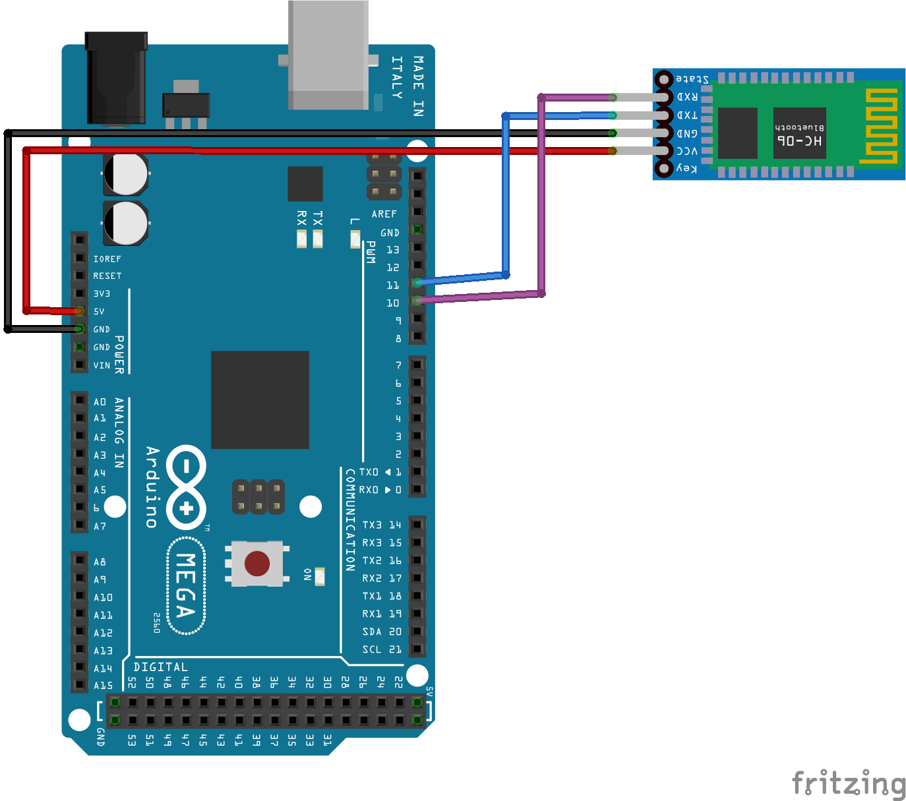

​    

* HC-06모듈의 TX는 아두이노의 RX 핀에, 모듈의 RX는 아두이노의 TX 핀에 교차 연결해야 합니다.

  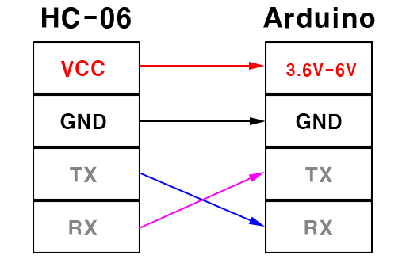

​    

#### 주의사항

반드시 확인해주세요.

<b>아두이노 메가</b> 및 <b>아두이노 메가 2560</b>제품의 RX 핀은 다음의 핀 번호들만 지원합니다.

+ 10, 11, 12, 13, 50, 51, 52, 53, 62, 63, 64, 65, 66, 67, 68, 69

​    

<b>아두이노 레오나르도</b> 및 <b>아두이노 마이크로</b>제품의 RX 핀은 다음의 핀 번호들만 지원합니다.

+ 8, 9, 10, 11, 14 (MISO), 15 (SCK), 16 (MOSI)

​    

---

### AT 모드

1. AT 모드는 HC-06모듈의 이름 변경, 핀 번호 변경, 마스터/슬레이브 모드 변경 등을 수행할 수 있습니다.

2. HC-06모듈에서 AT 모드는 별도의 설정없이 사용할 수 있습니다.

   단, 다른 기기와 연결된 상태에서는 AT 모드를 사용할 수 없습니다.

​    

AT 모드를 사용하려는 경우 호출 메소드를 아래 주소에서 확인하세요.

+ [AT Command](https://www.instructables.com/AT-command-mode-of-HC-05-Bluetooth-module/)

​    

---

### 예제

1. 셋업

```c++
#include <SoftwareSerial.h>

#define TX_PIN 10
#define RX_PIN 11

/*
 * HC 06의 TX를 아두이노의 RX핀(Digital 11)에 교차해서 연결
 * HC 06의 RX를 아두이노의 TX핀(Digital 10)에 교차해서 연결
 */

SoftwareSerial bluetoothSerial(RX_PIN, TX_PIN);

void setup() {
  Serial.begin(9600);
  while(!Serial) {
    ; // 시리얼 포트가 연결되기를 기다립니다.
  }

  bluetoothSerial.begin(9600);
}
```

​    

2. 통신

```c++
void loop() {
  if(bluetoothSerial.available()) {
    int receiveData = bluetoothSerial.read(); // 데이터를 읽습니다.
    Serial.write(receiveData); // 읽어온 데이터를 시리얼 모니터에 출력합니다.
  }

  if(Serial.available()) {
    int sendData = Serial.read(); // 시리얼 모니터에서 데이터를 얻습니다.
    bluetoothSerial.write(sendData); // 데이터를 보냅니다.
  }
}
```

​    

---

### blueBerry와 연동하기

#### 애플리케이션에서 스캔 및 페어링 요청

1. '테스트'메뉴의 [돋보기]를 터치해서 스캔 화면을 표시하세요.
2. 주변 기기를 찾기 위해서 '정확한 위치'권한을 허용하세요.

  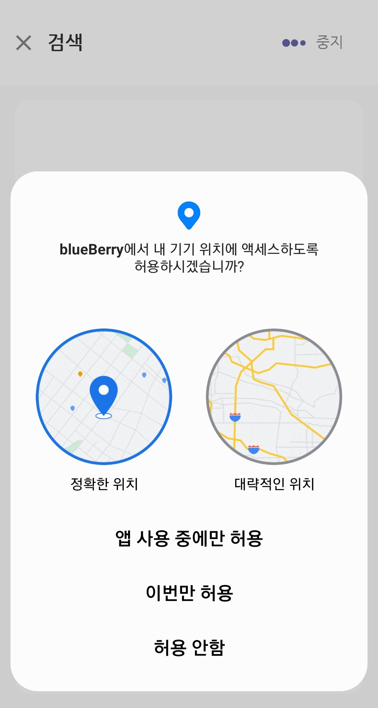

​    

3. 주변 기기 목록이 표시됩니다. HC-06 또는 설정한 이름이 표시된 기기를 터치해서 페어링 요청을 보내세요.

  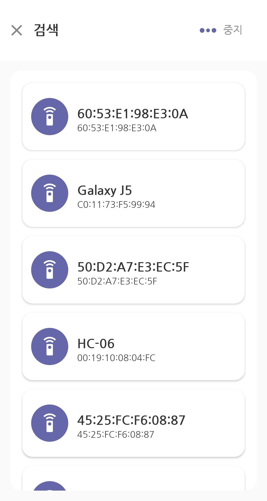

​    

4. 핀번호를 입력하세요. 기본 핀번호는 '1234'입니다.

  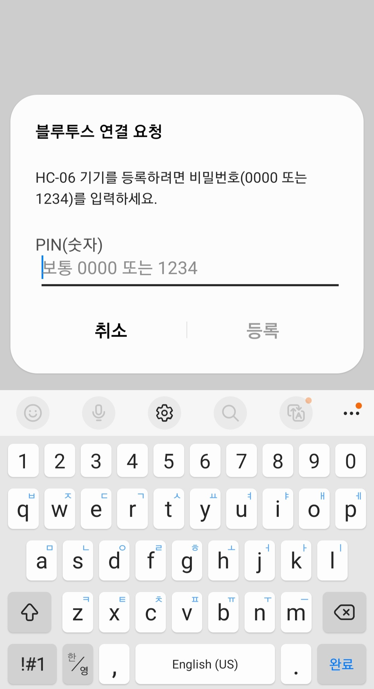

​    

5. 페어링을 성공하면 페어링된 디바이스 목록에 추가됩니다.

  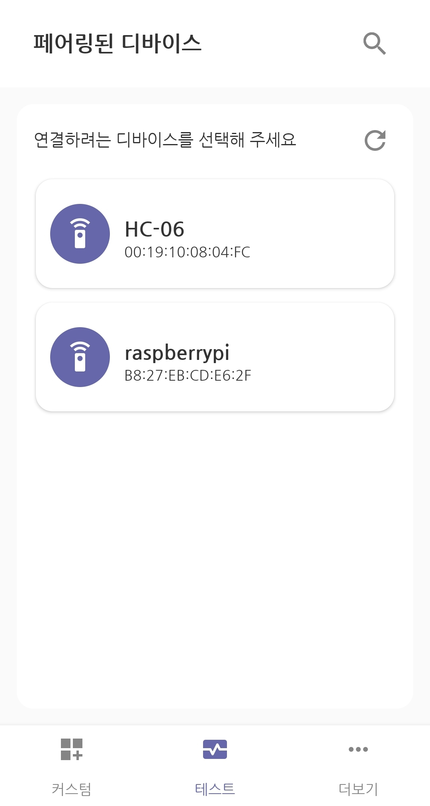

​    

#### 커스텀 모드로 사용하기

* 커스텀 모드는 사용자가 원하는 위젯을 선택하고 배치해서 리모컨처럼 연결된 기기를 제어할 수 있는 모드입니다.

​    

1. '커스텀'메뉴에서 '+'버튼을 터치하여 새 커스텀을 만드세요.
2. 커스텀의 고유한 이름을 지정해 주세요.

  

​    

3. 원하는 위젯 모양을 선택하세요.

  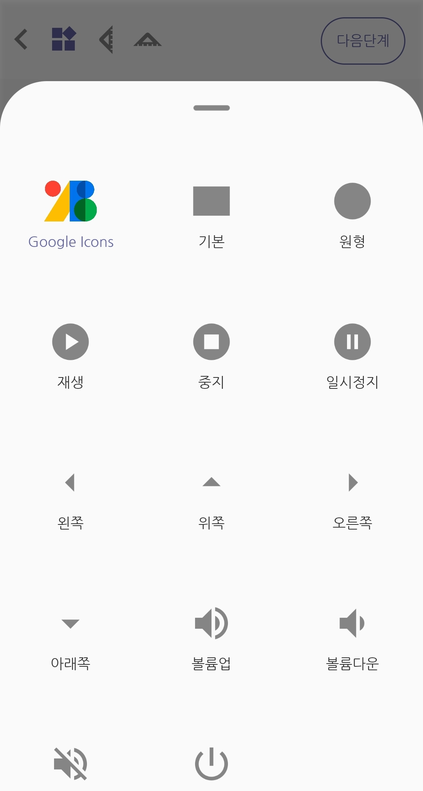

​    

4. 위젯 캡션 및 데이터를 설정하세요.
   * '캡션'은 커스텀 화면에만 표시되는 위젯의 이름입니다.
   * '데이터'는 연결된 디바이스로 전달되는 데이터 값입니다.

  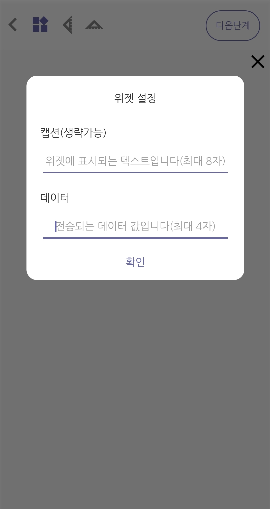

​    

5. 가이드라인을 이용해서 위젯을 배치하세요.

  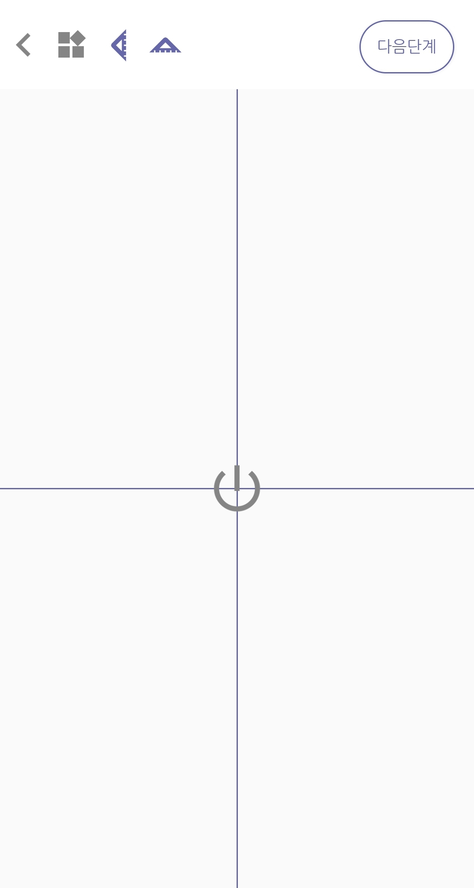

​    

6. 연결설정 단계에서 커스텀과 연결할 디바이스를 선택하세요.

  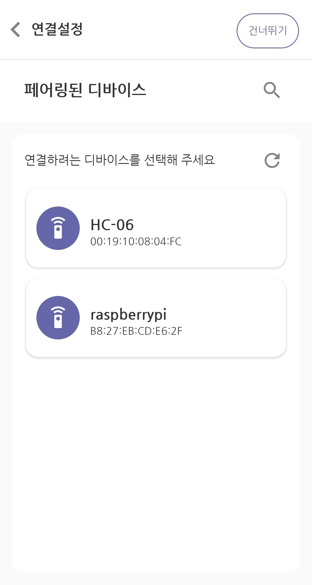

​    

7. '커스텀'메뉴에 생성한 커스텀이 등록됩니다.

  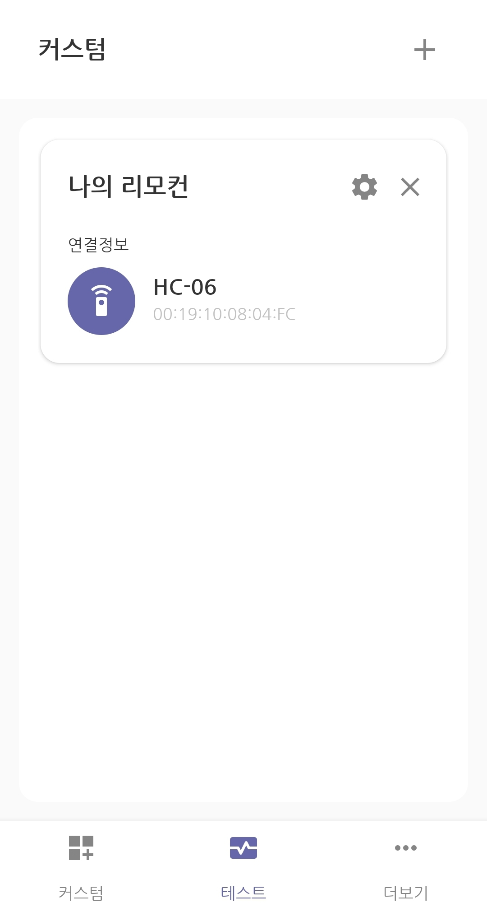

​    

8. 생성된 커스텀을 터치하여 등록된 기기에 연결 요청을 보내고 연결되면 통신할 수 있습니다.

  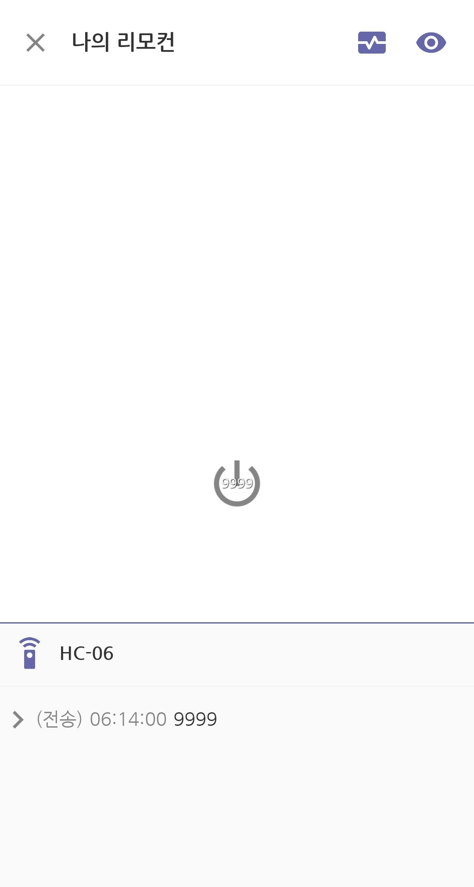

​    

#### 테스트 모드로 사용하기

* 테스트 모드는 페어링된 디바이스에 즉시 연결 요청을 보내고 연결된 디바이스와 채팅을 통해서

  간단하게 데이터 송, 수신을 테스트해 볼 수 있습니다.

​    

1. '테스트'메뉴에서 페어링된 기기를 터치하여 연결 요청을 보내세요.

  

​    

2. 연결 요청을 보내고 연결되면 통신할 수 있습니다.

  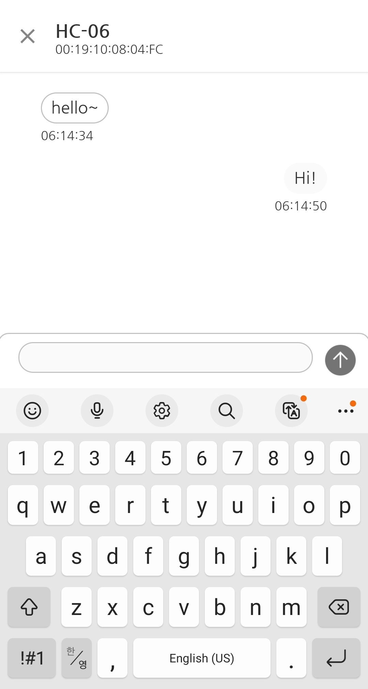

​    

---

